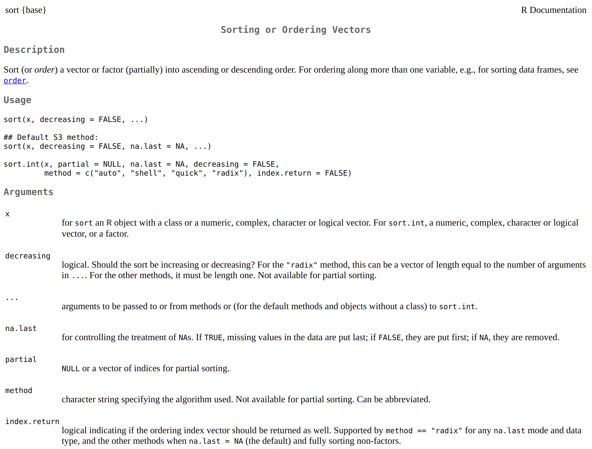

# The Basics

```{r}
"Hello, World!"
```


## R as a Calculator

```{r}
1 + 1                     # addition

1 - 1                     # subtraction

2 * 3                     # multiplication

1 + 1 * 3                 # combining operations

(1 + 1) * 3               # operator precedence

3 / 2                     # division

# ↓↓ pronounced "modulo"
3 %% 2                    # division remainder

4 %/% 2                   # integer division

3^2                       # exponents
4**2                      # also exponents!

Inf + 1       # 🤔
```


::: {.caution data-latex="{caution}"}

If your code doesn't form a complete _expression_, then R will look for more on the next line.

Here's an example:

```{r, eval=FALSE}
1 +
```

`1 + ` isn't a complete expression, so R prompt for more code on subsequent lines. You'll see something like the following:

```{r, eval=FALSE}
> 1 +
+
+
+
```

If this happens, press the __Esc__(scape) key (you may have to click on the Console pane first) and fix your code.

:::

## Fundamental Types

R has several basic data types that serve as the foundation upon which everything is built.

```{r}
1             # double (short for double-precision floating-point number)
3.14          # also double (we can just think of them as decimals)

1L            # integer (`L` for "Literal" or `long` integers)

"1"           # character or string (kinda... we'll discuss later)

TRUE          # logical (similar to `bool`s in other languages)
FALSE         # also logical

4i            # complex (we're never going to use these)
```

::: {.info data-latex="{info}"}

Like most programming languages, R lets us mix _comments_ into our code. Anything that follows `#` on the same line is ignored by R.

Comments enable us to annotate our work or temporarily (hopefully) disable lines of code.

```{r}
-1 * -1000 # a negative number times a negative is positive

# TRUE + FALSE # felt cute, might un-comment later  🤷
```

Leverage comments to communicate with humans! They're an opportunity for explaining _what_ something does and (often more-importantly) _why_ something works or is necessary.

Since comments are ubiquitous, it's worth pointing out two common conventions:

```{r}
# TODO(CC): CC (initials) is going to implement some behavior
# FIXME(BK): BK is going to fix some problem
```

:::

## Variables

R's assignment operator is `<-`.

```{r}
my_first_var <- "referring to data w/ names is handy!"
my_first_var
```

We can also use `=` like many other languages, but we _highly_ discourage this (especially starting out) because we use `=` elsewhere. If you stick to `<-`, you'll never have to guess where you've assigned variables or rely on context clues to predict `=`'s intended purpose or behavior.

You should always prefer descriptive variable names so that others can more easily understand your code. Most of the time, the other person will just be you in the future.

```{r}
length <- 2
width <- 4

area <- length * width
area
```


## Multiple Values

We'll almost always need to deal with more than one value, so R let's us `c()`ombine values. 

```{r}
c(1, 2, 3, 4, 5)
```

We won't get into the nitty-gritty details just yet, but we typically call a collection of values of the same type (_homogeneous_) a `vector`.

R is special for a few reasons and having native `vector`s is definitely one of them. Understanding how they work is fundamental to writing good (and fast!) code.


```{r}
c(1, 2, 3, 4, 5, 6)       # `c()` is short for "combine"

1:6                       # `:` lets us create sequences

my_first_vector <- -5:5 # we'll explain `vector`s later,
my_first_vector
```

## Functions

```{r}
# ↓️️ name of function
sqrt(x = 16)
```

R comes with some handy variables built-in , such as `letters` and `LETTERS`.

```{r}
letters

LETTERS
```


```{r}
#       ↓ parameter, formal, or argument 
toupper(x = letters)

#           ↓↓↓↓↓↓↓ argument (always)
tolower(x = LETTERS)
```

We refer to `x = letters` as a _named_ argument because we specify the parameter (`x`) to which we're passing our argument (`letters`), but we often don't specify the name of a parameter.

```{r}
tolower(letters)
```

We can't screw up too easily since `tolower()` and `toupper()` only have one paramter (`x`), but many functions can take multiple arguments.

Let's say we have a `vector` of `unsorted_numbers`:

```{r}
unsorted_numbers <- c(3, 2, 10, 8, 1, 4, 9, 6, 5, 7)
unsorted_numbers
```

Like most languages, R has a built-in `sort()` function we can use, which works like so:

```{r}
sort(x = unsorted_numbers)
```

By default, `sort()` sorts in _ascending_ order, but we oftentimes will want to sort in _descending_ (or `decreasing`) order.

Rather than having a separate function called `sort_decreasing()`, we pass an argument to `sort()`'s `decreasing` parameter.

```{r}
sort(x = unsorted_numbers, decreasing = TRUE)
```

Even though `sort()` has multiple parameters, we can still skip the names if we pass our arguments _by position_.

```{r}
sort(unsorted_numbers, TRUE)
```

Considering that `x` is `sort()`'s first parameter, and `decreaing` is `sort()`'s second parameter, we can pass our arguments (`unsorted_numbers` and `TRUE`) in the same order and R will know what we meant.

We can also mix _positional_ and _named_ argument (and often do), but we should always prioritize _readable_ code.

```{r}
sort(unsorted_numbers, decreasing = TRUE) # good

sort(x = unsorted_numbers, TRUE)          # avoid this

sort(decreasing = TRUE, unsorted_numbers) # just... no
```

## Documentation

You're hopefully wondering "How could we know the order of `sort()`'s parameters?" which leads us to documentation.

If you want more information on a specific function, you should [check out the documentation](https://en.wikipedia.org/wiki/RTFM), which you can do with `?` or `help()`.

Here's what that looks like for `sort()`

```{r, eval=FALSE}
?sort 
```

```{r, eval=FALSE}
help(sort) # does the same thing as `?sort`
```


```{r, echo=FALSE}

```


There's _a ton_ of information here, but all we're interested in at the moment is the order in which we need to pass arguments to `sort()`, which we can find in the __Arguments__ section.


## Missingness and Nothingness

### `NA`

You may have noticed the `na.last` argument in `sort()`'s documentation. R can represent nothingness with `NULL` (same as `null` or `None` in other languages), but it can also represent _unknown_ or _missing_ values with `NA`.

```{r}
unsorted_numbers_with_nas <- c(3, 2, 10, 8, NA, 1, 4, 9, NA, 6, 5, 7)
unsorted_numbers_with_nas
```

`sort()`'s default behavior is `na.last = NA`, which simply removes any `NA`s.

```{r}
sort(unsorted_numbers_with_nas)
```

If we want to keep `NA`s, we must specify whether `sort()` places them first or last.

```{r}
sort(unsorted_numbers_with_nas, na.last = TRUE)
sort(unsorted_numbers_with_nas, na.last = FALSE)
```

### `NULL`

For the moment, think of the difference between `NA` and `NULL` as being that `vector`s (like `unsorted_numbers_with_nas`) can have `NA` values but they cannot have `NULL` values.

If we try to put `NULL` in a `vector`, it simply disappears.

```{r}
c(3, 2, 10, 8, NULL, 1, 4, 9, NULL, 6, 5, 7)
```


But, how do we check if something is `NA` or `NULL`?


## Predicate Functions

A _predicate function_ is a function that `return`s either `TRUE` or `FALSE` based on some condition the function is checking. 

Predicate functions _should_ use a name that expresses this intent, such as `is<some condition>`, `any<some condition>()`, or `all<some condition>()`.

If we want check if something is `NULL`, we use `is.null()`.

```{r}
is.null("this string isn't NULL!")
is.null(NULL)
```

R has _many_ built-in predicate functions, including ones to check the basic data types that we've already seen.

```{r}
is.double(1)
is.double(1L)

vec_dbl <- c(8, 6, 7, 5, 3, 0, 9)
is.double(vec_dbl)

is.integer(1)
is.integer(1L)
vec_int <- 1:10
is.integer(vec_int)

is.character(3.14)
is.character("is it though?")
is.character(letters)

is.logical("the year 2020")
is.logical(TRUE)
is.logical(FALSE)
vec_lgl <- c(TRUE, FALSE, TRUE)
is.logical(vec_lgl)
```


Similar to `is.null()`, there's `is.na()`. 

```{r}
is.na("not NA!")
is.na(NA)
```

Recall our variable `unsorted_numbers_with_nas`.

```{r}
unsorted_numbers_with_nas
```

Consider the following:

- The predicate functions we've seen so far `return` either `TRUE` or `FALSE`.
- `vector`s can contain both `NA` _and_ non-`NA` values.

Can you guess what `is.na()` `return`s?

```{r}
is.na(unsorted_numbers_with_nas)
```

```{r, echo=FALSE}

```


We'll discuss accessing a `vector`'s individual elements later, but `is.na()` is what we call a _vectorized_ function: a function that takes `vector` argument and operates on every element simultaneously.

## Vectorized Functions

As high-speed R coders, we should prefer `vector`ized solutions whenever possible as they're not only idiomatic (and thus easy for other R users to understand), but they're typically several orders of magnitude faster than other solutions.

While R isn't the fastest language out there, complaints about its speed usually come from poor code, including code that "speaks" R with a C or Python accent.

The simplest way to wrap our heads around `vector`ized operations is with math. let's first make a `vector` with five `0`s in it.

We could do that like the following:

```{r}
c(0, 0, 0, 0, 0)
```

But, good coders are _lazy_ and want to (correctly) automate everything they can. With that  in mind, let's `rep()`eat `0` `5` times.

```{r}
zeros <- rep(0, length = 5)
zeros
```

For our purposes, the term _scalar_ refers to an object that is a single value.

If we want to add `1` (a scalar) to every element of `zeros`, we can run `zeros + 1` or `1 + zeros`:

```{r}
zeros + 1
```

R knows that `1` is a single value (and assumes we know what we're doing) and performs the operation (`+`) between it and every element of `zeros`. In R-speak, we refer to this behavior as _recycling_.


Let's see what happens when we add `zeros` and a `vector` containing two elements.

```{r}
two_threes <- c(3, 3)

zeros + two_threes
```

That's probably not what you expected and R gives us a `warning()` to tell us something seems wrong.

R let's us get away with a lot of things it shouldn't, which includes


